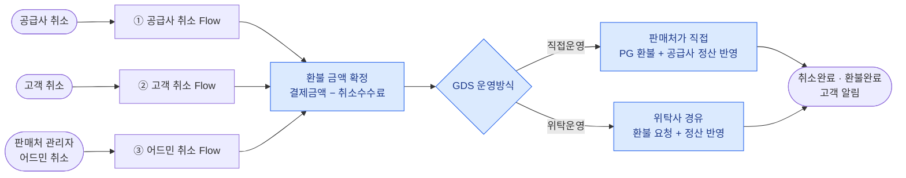
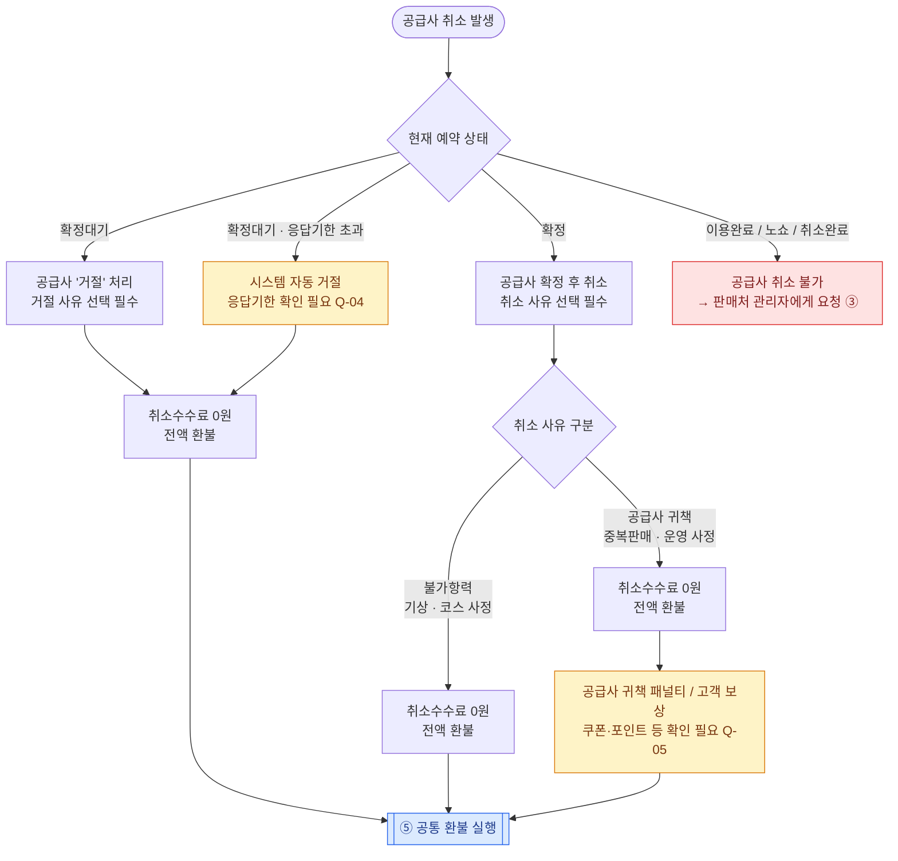
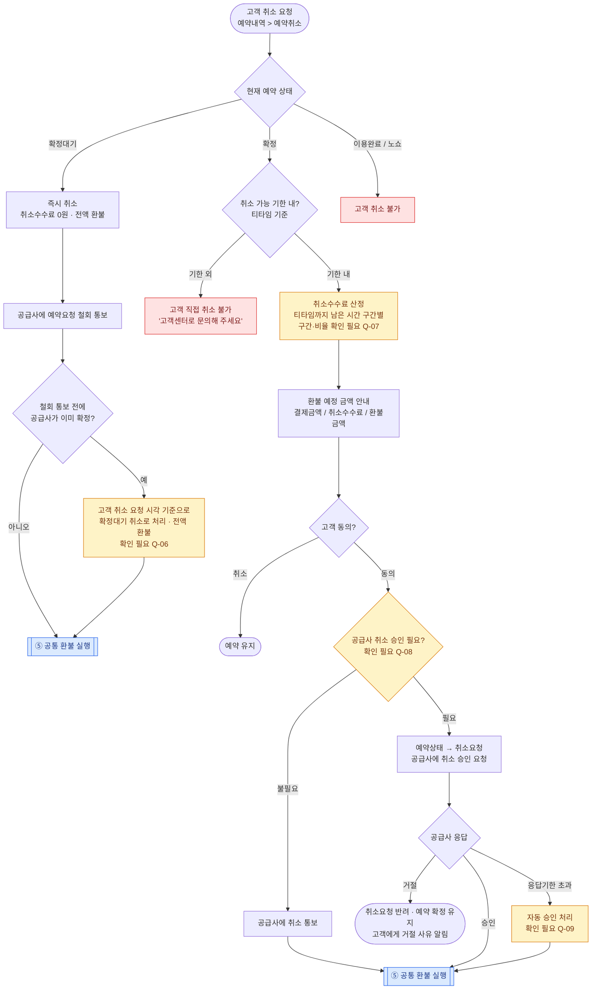
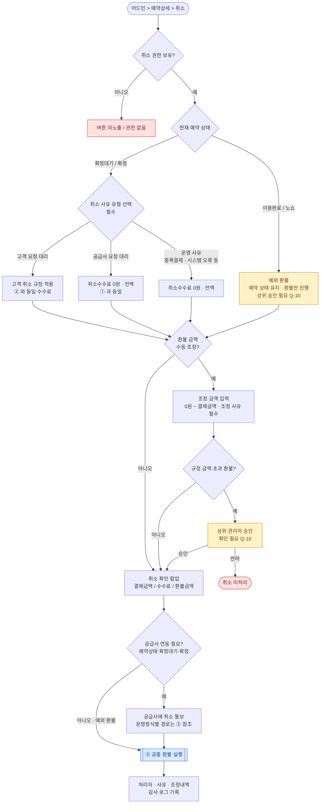
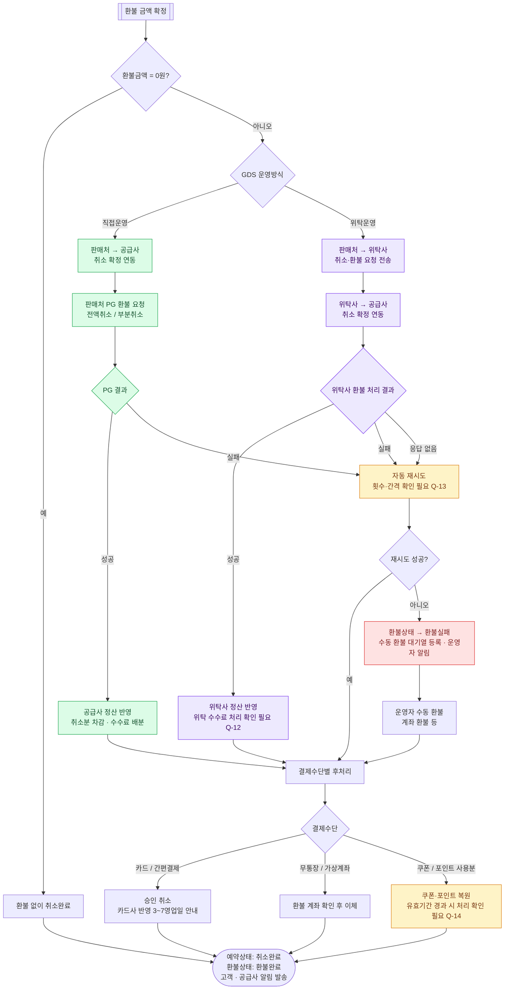

# [골프예약시스템] 확인예약 취소·환불 Flow Chart

| 항목 | 내용 |
|---|---|
| 문서 ID | FLW-RFD |
| 대상 | 예약방식 = **확인예약** 의 취소·환불 |
| 취소 주체 | ① 공급사 ② 고객 ③ 판매처 관리자(어드민) |
| 분기 조건 | GDS 운영방식 = **직접운영 / 위탁운영** |
| 문서 상태 | 초안 v0.1 – 기획 확인 대기 |
| 작성일 | 2026-10-06 |

> **읽는 법**
> - 노란 노드 = 근거 자료 없이 둔 **가정/제안값** (`확인 필요` 표기, 하단 Q 목록과 연결)
> - 파란 노드 = 공통 환불 실행 프로세스(⑤)로 넘어가는 지점
> - 빨간 노드 = 취소/환불 불가 종료

---

## 전제 (가정)

| 구분 | 가정 내용 | 확인 |
|---|---|---|
| 확인예약 | 고객이 예약 요청 시 **결제 완료** → 공급사가 응답기한 내 **확정/거절** → 확정 시 예약 성립 | Q-01 |
| 직접운영 | 판매처가 결제(PG) 주체. 공급사 취소 연동·PG 환불·공급사 정산을 **판매처가 직접** 수행 | Q-02 |
| 위탁운영 | 판매처는 판매 채널만 담당. 공급사 연동·환불 실행·정산은 **위탁사(운영 대행사)를 경유** | Q-02 |
| 예약 상태 | `확정대기` → `확정` → `이용완료` / `취소요청` / `취소완료` / `노쇼` | Q-03 |
| 환불 상태 | `환불대기` → `환불진행` → `환불완료` / `환불실패(수동처리)` | Q-03 |

---

## ⓪ 전체 개요

---

## ① 공급사가 취소할 때

**포인트**
- 공급사 취소는 사유와 무관하게 **고객 전액 환불**이 원칙(고객 귀책 없음).
- 귀책 여부는 고객 환불액이 아니라 **공급사 정산(패널티)** 에만 영향.

---

## ② 고객이 취소할 때

**포인트**
- **확정 전** 취소는 언제나 전액 환불.
- **확정 후** 취소수수료 기준 시각은 `고객이 취소를 요청한 시각`(공급사 승인 시각 아님). 확인 필요 Q-07
- 경계값: 취소 가능 기한 **정각**에 요청한 경우 기한 내/외 판정 필요. 확인 필요 Q-07

---

## ③ 판매처 관리자가 어드민에서 취소할 때

**포인트**
- 어드민 취소는 **사유 유형**이 수수료 기준을 결정한다(누가 원했는지).
- 공급사 승인 대기 없이 즉시 취소 처리하는 것을 가정. 공급사 사전 협의 필요 여부 확인 필요 Q-11

---

## ④ 취소 주체별 비교

| 구분 | ① 공급사 취소 | ② 고객 취소 | ③ 어드민 취소 |
|---|---|---|---|
| 확정대기 상태 | 거절 → 전액 | 즉시 취소 → 전액 | 사유 유형 따름 |
| 확정 상태 | 전액 (귀책 시 패널티) | 기한 내 수수료 차감 / 기한 외 불가 | 사유 유형 따름 + 수동 조정 |
| 공급사 승인 | 해당 없음 | 필요 여부 Q-08 | 불필요(통보) Q-11 |
| 이용완료/노쇼 | 불가 | 불가 | 예외 환불(승인) |
| 수수료 부담 | 없음 | 고객 | 사유에 따라 |

---

## ⑤ 공통 환불 실행 (GDS 운영방식 분기)

**운영방식별 차이 요약**

| 단계 | 직접운영 (초록) | 위탁운영 (보라) |
|---|---|---|
| 공급사 취소 연동 | 판매처 ↔ 공급사 직접 | 판매처 → 위탁사 → 공급사 |
| 환불 실행 주체 | 판매처(PG) | 위탁사 |
| 정산 반영 | 판매처가 공급사 정산 차감 | 위탁사 정산 + 위탁 수수료 |
| 실패 시 책임 | 판매처 운영자 | 위탁사 → 판매처 운영자 에스컬레이션 Q-13 |

---

## 기획 확인 필요 사항

| ID | 질문 | 관련 Flow |
|---|---|---|
| Q-01 | 확인예약은 요청 시점에 결제 완료인가, 가승인(확정 시 매입)인가? 가승인이면 확정대기 취소는 '환불'이 아니라 '승인 취소' | ①②③⑤ |
| Q-02 | 직접운영 / 위탁운영의 정의가 위 전제와 맞는가? 위탁운영 시 결제(PG) 주체는 판매처인가 위탁사인가? | ⑤ |
| Q-03 | 예약 상태·환불 상태 코드 목록 | 전체 |
| Q-04 | 공급사 확정 응답기한(예: 요청 후 N시간)과 초과 시 자동 거절 여부 | ① |
| Q-05 | 공급사 귀책 취소 시 패널티·고객 보상 기준 | ① |
| Q-06 | 고객 취소와 공급사 확정이 동시에 발생하면 어느 쪽을 우선하는가? | ② |
| Q-07 | 취소 가능 기한, 구간별 취소수수료율, 기한 정각 요청 시 판정, 수수료 기준 시각(요청 시각 vs 승인 시각) | ②③ |
| Q-08 | 확정 후 고객 취소 시 공급사 승인이 필요한가, 통보만 하는가? | ② |
| Q-09 | 공급사가 취소 승인 요청에 응답하지 않을 때 자동 승인 / 자동 반려 / 운영자 개입 중 무엇인가? | ② |
| Q-10 | 어드민 수동 금액 조정 · 이용완료 후 예외 환불의 승인 체계(누가, 금액 기준) | ③ |
| Q-11 | 어드민 취소 시 공급사 사전 협의·승인이 필요한가? | ③ |
| Q-12 | 위탁운영 시 취소 건의 위탁 수수료 처리 방식 | ⑤ |
| Q-13 | 환불 실패 시 자동 재시도 횟수·간격, 위탁사 무응답 시 에스컬레이션 기준 | ⑤ |
| Q-14 | 쿠폰·포인트 복원 시 유효기간이 지난 경우 처리 | ⑤ |
| Q-15 | 부분 취소(인원 감소 등)도 이 Flow에 포함하는가? 현재는 전체 취소만 반영 | 전체 |

---

## 변경 이력

| 버전 | 일자 | 변경 내용 | 작성자 |
|---|---|---|---|
| v0.1 | 2026-10-06 | 확인예약 취소 주체 3종 × GDS 운영방식 2종 환불 Flow 초안 | Claude Code (요청: yj.choi) |
